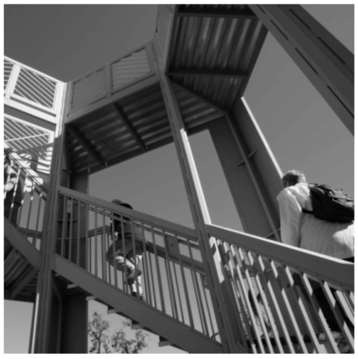
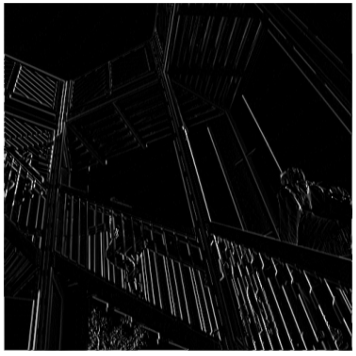
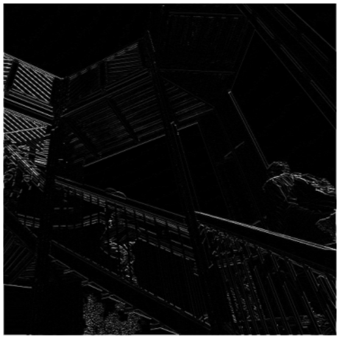
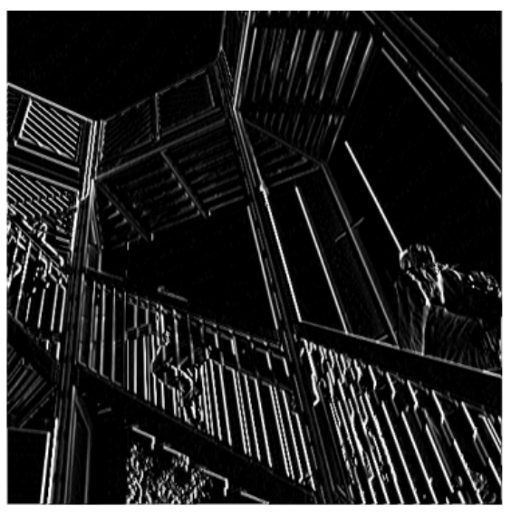
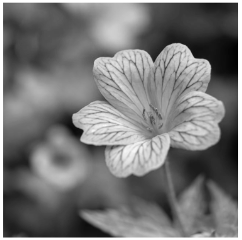
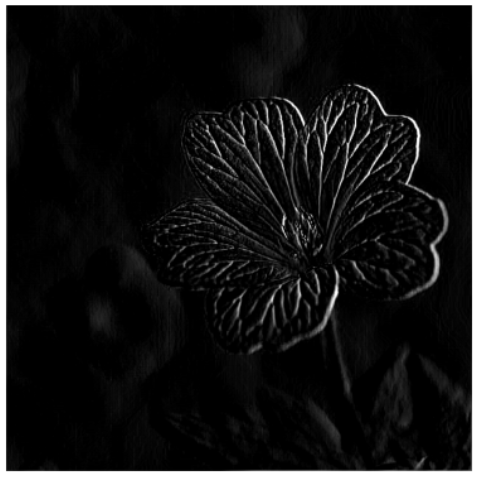
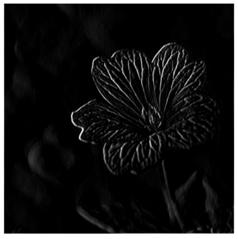
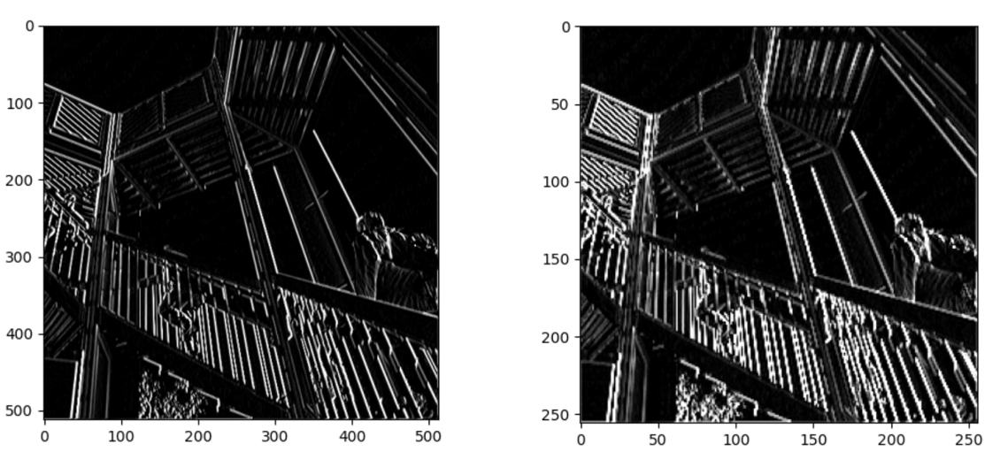
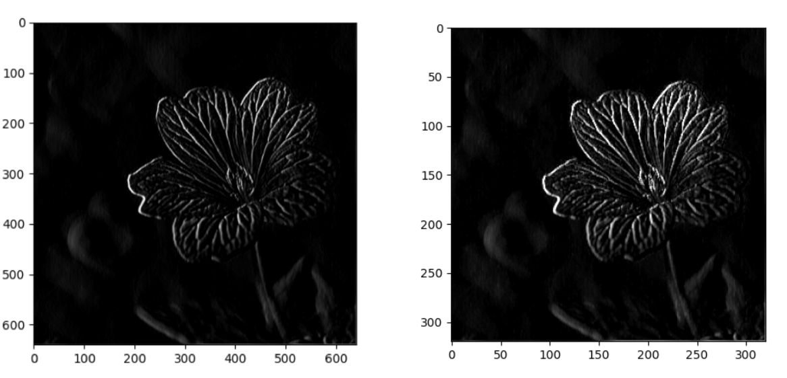

**Modify the existing filter and if needed the associated weight in order to apply your new filters to the image 3 times. Plot each result, upload them to your response, and describe how each filter transformed the existing image as it convolved through the original array and reduced the object size.**

Original stair image:



```
filter1 = [[1, 1, 1], [-1, -1, -1], [0, 0, 0]]
```



The first filter appears to focus on vertical lines in the image; overall the image is very dark and you can really only see the vertical lines of the stair railing and the diagonal lines in the upper left. The top middle of the image is almost gone.

```
filter2 = [[0, 0, 0], [-2, 4, -2], [0, 0, 0]]
```



The second filter emphasizes the diagonal lines in the upper left corner of the image, and not much else. Some diagonal lines are visible on the right side of the image, but most of the image is gone (dark). 

```
filter3 = [[2, 2, 2], [0, -2, 0], [-2, 0, -2]]
```



The third filter shows the vertical lines in the image very strongly, as well as many of the horizontal lines as well. This filter is the “best” in terms of visibility of features of the image; vertical, diagonal, and horizontal lines are all pretty clear. 

**What are you functionally accomplishing as you apply the filter to your original array?**


**Why is the application of a convolving filter to an image useful for computer vision?**


**Stretch goal: instead of using the misc.ascent() image from scipy, can you apply three filters and weights to your own selected image? Again describe the results.**

Original flower image:



```
filter1 = [[0, -2, 0], [0, 0, 0], [1, 0, 1]]
```


```
filter2 = [[2, 2, 2], [2, -4, 2], [-2, -2, -2]]
```



```
filter3 = [[-4, 0, -4], [2, 0, 2], [2, 0, 2]]
```



**Another useful method is pooling. Apply a 2x2 filter to one of your convolved images, and plot the result.**



**In effect what have you accomplished by applying this filter?**


**Does there seem to be a logic (i.e. maximizing, averaging or minimizing values?) associated with the pooling filter provided in the example exercise (convolutions & pooling)?**


**Did the resulting image increase in size or decrease? Why would this method be useful?** 


**Stretch goal: again, instead of using misc.ascent(), apply the pooling filter to one of your transformed images.**



**Convolve the 3x3 filter over the 9x9 matrix and provide the resulting matrix.**
