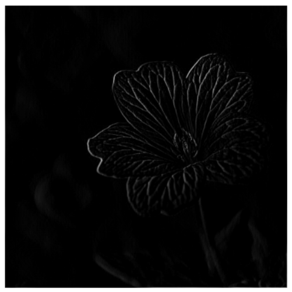

### Convolutions

**Modify the existing filter and if needed the associated weight in order to apply your new filters to the image 3 times. Plot each result, upload them to your response, and describe how each filter transformed the existing image as it convolved through the original array and reduced the object size.**

Original stair image:


```
filter1 = [[1, 1, 1], [-1, -1, -1], [0, 0, 0]]
```


The first filter appears to focus on vertical lines in the image; overall the image is very dark and you can really only see the vertical lines of the stair railing and the diagonal lines in the upper left. The top middle of the image is almost gone.

```
filter2 = [[0, 0, 0], [-2, 4, -2], [0, 0, 0]]
```


The second filter emphasizes the diagonal lines in the upper left corner of the image, and not much else. Some diagonal lines are visible on the right side of the image, but most of the image is gone (dark). 

```
filter3 = [[2, 2, 2], [0, -2, 0], [-2, 0, -2]]
```


The third filter shows the vertical lines in the image very strongly, as well as many of the horizontal lines as well. This filter is the “best” in terms of visibility of features of the image; vertical, diagonal, and horizontal lines are all pretty clear. 

**What are you functionally accomplishing as you apply the filter to your original array?**

The 3x3 filter is applied to sets of 3x3 pixels in the original array. For each pixel, the neighbor values (in a 3x3 area) are considered and the filter is used to calculate a new value for the pixel. The pixel and neighbor pixels are multiplied by the filter values and added up to create the new pixel value for the new image. The filter is then moved over a column of pixels to the next set of 3x3 pixels, and applied again. 

**Why is the application of a convolving filter to an image useful for computer vision?**

A convolving filter is useful for computer vision because it processes the image to raw features. Ideally, the features that are most prominent are the features that are most important in the image. Watching the Maroney video, convolutions help with extracting features of an image for use in classification; instead of just looking at and matching the individual pixels in the image, sets of features can be matched to a label. 

***Stretch goal:*** **instead of using the misc.ascent() image from scipy, can you apply three filters and weights to your own selected image? Again describe the results.**

Original flower image:


```
filter1 = [[0, -2, 0], [0, 0, 0], [1, 0, 1]]
```



Filter 1 produced a very dark image. Part of the outline and veins of the flower can be seen; emphasis seems to be on the somewhat vertical lines in the image.

```
filter2 = [[2, 2, 2], [2, -4, 2], [-2, -2, -2]]
```


The second filter shows more features of the flower and there is stronger emphasis on the features on the right side of the flower.

```
filter3 = [[-4, 0, -4], [2, 0, 2], [2, 0, 2]]
```


Filter 3 appears to capture features almost opposite those of filter 2. The left side of the flower is more clearly outlined versus the right, and ‘top’ lines are more emphasized than lines on the ‘bottom’ or shadowed edges of the flower. 


### Pooling

**Another useful method is pooling. Apply a 2x2 filter to one of your convolved images, and plot the result.**


**In effect what have you accomplished by applying this filter?**

By applying this pooling filter, the size of the image is reduced but the features filtered by the convolving filter are still present. A 2x2 filter, such as this one, takes a 2x2 block (or four pixels) and ‘chooses’ (max/min/avg/etc.) a value to load into the new image. This reduces the size of the image, which can be seen in the dimensions of the original vs pooled image above - 512x512 is reduced to 256x256. 

**Does there seem to be a logic (i.e. maximizing, averaging or minimizing values?) associated with the pooling filter provided in the example exercise (convolutions & pooling)?**

This pooling filter seems to be a maximizing feature. It looks at a 2x2 area of pixels in the image, sorts the values of the pixels in descending order, and then chooses the first value from the list. So effectively, the filter chooses the maximum value from each 2x2 area and returns that as the pixel value for the new image.

Code for reference:

```
new_x = int(size_x/2)
new_y = int(size_y/2)
newImage = np.zeros((new_x, new_y))
for x in range(0, size_x, 2):
  for y in range(0, size_y, 2):
    pixels = []
    pixels.append(i_transformed[x, y])
    pixels.append(i_transformed[x+1, y])
    pixels.append(i_transformed[x, y+1])
    pixels.append(i_transformed[x+1, y+1])
    pixels.sort(reverse=True)
    newImage[int(x/2),int(y/2)] = pixels[0]
```

**Did the resulting image increase in size or decrease? Why would this method be useful?** 

The resulting image decreased in size, from 512x512 to 256x256. This would be useful in making processing more time efficient because the features are maintained in the image, but the ‘noise’ is gone. The image is smaller so there is less information that needs to be processed by the computer. 

***Stretch goal:*** **again, instead of using misc.ascent(), apply the pooling filter to one of your transformed images.**


### Bonus

**Convolve the 3x3 filter over the 9x9 matrix and provide the resulting matrix.**


Result: 

```
[[0, 0, 0, 3, 0, 0, 0],
 [0, 0, 0, 3, 0, 0, 0],
 [1, 1, 1, 3, 1, 1, 1],
 [1, 1, 1, 3, 1, 1, 1],
 [1, 1, 1, 3, 1, 1, 1],
 [0, 0, 0, 3, 0, 0, 0],
 [0, 0, 0, 3, 0, 0, 0]]
```


**Video source:** [Machine Learning Foundations: Ep #3 - Convolutions and Pooling](https://www.youtube.com/watch?v=PCgLmzkRM38&t=76s)

**Code:** [Feb21Response.py](https://github.com/natallzl/data310/blob/main/Feb21Response.py)

**Flower photo source:** [Unsplash](https://unsplash.com/photos/F6COrdbhFqQ)
