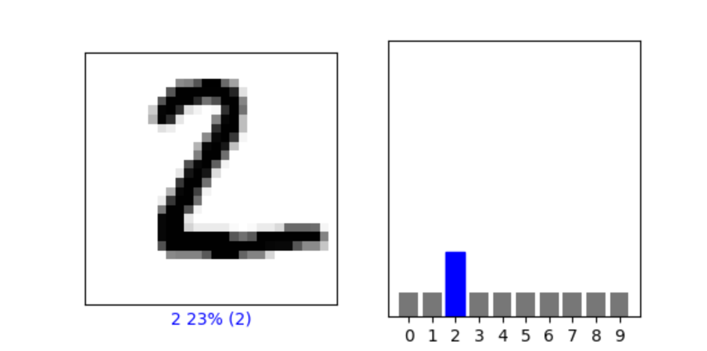

**In the video, First steps in computer vision, Laurence Maroney introduces us to the Fashion MNIST data set and using it to train a neural network in order to teach a computer “how to see.” One of the first steps towards this goal is splitting the data into two groups, a set of training images and training labels and then also a set of test images and test labels. Why is this done? What is the purpose of splitting the data into a training set and a test set?**

The training set is used to train the neural network and helps it to learn what each image is based on the training image and corresponding training label. Then, we need a way to test the neural network’s ability to predict what an image is, so we use a test set. The test set has to be a different set of images and labels from the training set, because the computer has already seen the training set.   

**The fashion MNIST example has increased the number of layers in our neural network from 1 in the past example, now to 3. The last two are .Dense layers that have activation arguments using the relu and softmax functions. What is the purpose of each of these functions. Also, why are there 10 neurons in the third and last layer in the neural network.**

The purpose of relu is look at the output of a neuron, and if it is less than zero to set it to zero. This function is used because negative outputs could skew future values by cancelling out positive values. So, by making negative outputs zero we can avoid messing up our results later on. 

The purpose of softmax is to help find the most likely candidate (so in this case, what clothing item the image is most likely showing). Each of the ten neurons in the last layer calculates a probability for the image, and softmax sets the highest probability to 1.0 and the rest to 0, so to make the final decision you just need to find the 1.  

There are 10 neurons in the last layer in the neural network because there are 10 different types of clothing in the fashion MNIST dataset. Each of the 10 neurons will calculate the probability that a particular image represents each of the 10 clothing items. 

**In the past example we used the optimizer and loss function, while in this one we are using the function adam in the optimizer argument and sparse_categorical- crossentropy for the loss argument. How do the optimizer and loss functions operate to produce model parameters (estimates) within the model.compile() function?**

In Maroney's example, each neuron is initialized with random parameters and each pixel is fed in one by one and is added up to get an answer. Then, the loss function calculates how good or bad that answer is, and the optimizer function then tries different parameters and the model runs again. So, the loss function evaluates how well the model predicts the dataset and the optimizer updates the model in response to the loss function and how good or bad the answer is. 

**Using the mnist drawings dataset (the dataset with the hand written numbers with corresponding labels) answer the following questions.**

**1. What is the shape of the images training set (how many and the dimension of each)?**

In the images training set there are 60,000 training images, and each image is 28x28 pixels.

**2. What is the length of the labels training set?**

The length of the labels training set is 60,000, so there are 60,000 labels in the training set. This makes sense, because there are 60,000 images in the images training set and each image needs a corresponding label.

**3. What is the shape of the images test set?**

In the images test set there are 10,000 test images, and each image is 28x28 pixels. 

**4. Estimate a probability model and apply it to the test set in order to produce the array of probabilities that a randomly selected image is each of the possible numeric outcomes (look towards the end of the basic image classification exercises for how to do this — you can apply the same method applied to the Fashion MNIST dataset but now apply it to the hand written letters MNIST dataset).**

Following the method applied to the fashion MNIST dataset in Maroney’s example, I estimated a probability model and was able to apply it to the hand written letters MNIST test set (note: code updated after class on 2/8). I tested the second image in the test set (index 1), and produced an array of probabilities that the image is each of the possible numeric outcomes from 0 to 9. The array produced was:
```
[0.08533677, 0.08533685, 0.23196895, 0.08533677, 0.08533677,
       0.08533683, 0.08533677, 0.08533677, 0.08533677, 0.08533677]
 ```
Each number in the array is a probability. The largest probability in the array corresponds to the number that the image most likely shows. In this example, that number is 2. 

**5. Use np.argmax() with your predictions object to return the numeral with the highest probability from the test labels dataset.**

Using np.argmax() on the predictions object for the second image from the test set returns 2, so the highest probability result is that the image is a 2. Then, we can also look at the test label for the corresponding test image... and it is 2.  

**6. Produce a plot of your selected image and the accompanying histogram that illustrates the probability of that image being the selected number.**




**Video source:** [Machine Learning Foundations: Ep #2 - First Steps in Computer Vision](https://www.youtube.com/watch?v=j-35y1M9rRU)

**Code:** [Feb8Response.py](https://github.com/natallzl/data310/blob/main/Feb8Response.py)
