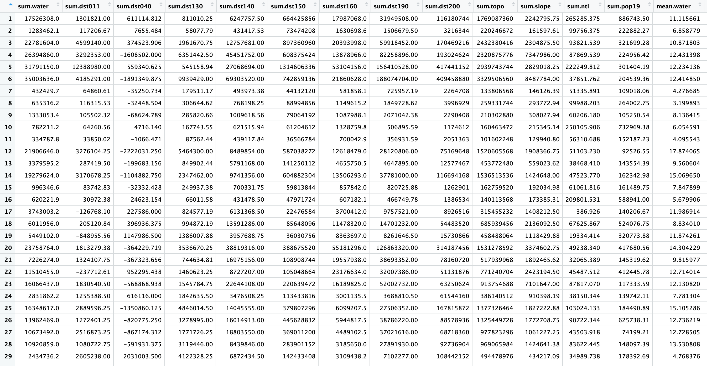
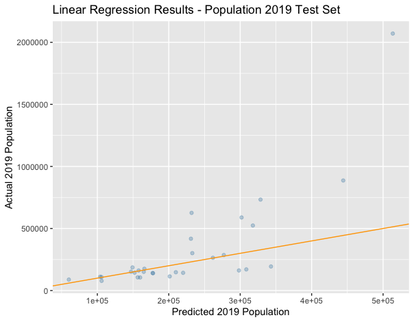
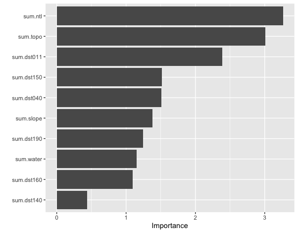

**For each of the following three steps you only need to download the administrative subdivisions, and their associated files not complete the entire exercise.**

1. Download the administrative subdivision for your selected country (Zambia).

2. Download the population raster from Worldpop for your selected county (Zambia).

3. Download the 12 rasters from your selected country (Zambia) and stack them.

**Produce a raster stack and calculate summary statistics.**

(this shows only a sample of the stats)

**R2 Plot and Variable Importance**

