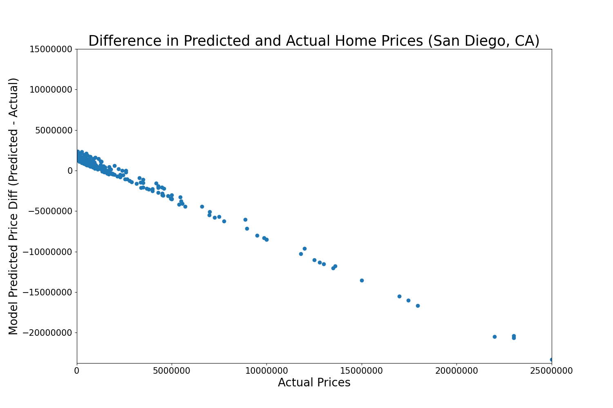

## Project 1

### Homes in San Diego, CA

Information (price, number of bedrooms, number of bathrooms, and total square footage) for homes in San Diego, CA was obtained by scraping Zillow listings using the zillow_scrape.py script provided to us in class. This script output a .csv file, which was then read into my project1.py script; linked at the bottom of the page. In that script, the scraped data was imported and used to train a model to predict home price, and plots were created to visualize the data and model outcome. 

**Description of the scraped housing data:**

I obtained 400 observations from San Diego, CA. Below are some basic barplots that visualize the scraped housing data for number of bedrooms, number of bathrooms, square footage, and price. Most observed homes in San Diego, CA had between 2-4 bedrooms, 2-3 bathrooms, a square footage between 1144 and 1875 square feet, and cost between $450,000 and $1,385,000. As evident in the boxplots, there are outliers for all variables scraped and these outliers exist on the higher end of the data. Because of these outliers, the data are skewed and the mean is greater than the median for all of the variables (see table below for exact statistics). 


As is evident from the boxplots, there are quite a few outliers in the data, particularly when looking at home price. There is a large range in prices; the least expensive home is $7,900 and the most expensive home is $25 million. Though the maximum price is quite high, the mean home price is $1,878,278.86 and the median home price is $699,999.5, and most homes fall between $450,000 and $1,385,000. The plot below is an additional visualization that shows the postive skewness of the price data. 


Finally, below is a table of descriptive statistics for the housing data scraped from Zillow:


|      |  Home Price     | Number of Bedrooms     | Number of Bathrooms |  Total Square Footage | 
| ----------- | ----------- | ----------- | ----------- | ----------- |
| **mean**      | $1,878,278.86      | 3.28       | 2.89        | 1992.51      |
| **standard deviation**     | $3,477,728.46    | 1.29     | 1.81     | 1676.09       |
| **minimum**      | $7,900       | 1       | 1       | 500       |
| **25%**      | $450,000      | 2      |  2       | 1144      |
| **median**      | $699,999.5      | 3       | 2       | 1447.5       |
| **75%**      | $1,385,000       | 4      | 3       | 1875      |
| **maximum**     | $25,000,000       | 8       | 10       | 8694       |


**Description of the model architecture:**

The model architecture is pretty much identical to the model that was previously used to predict prices of homes in Mathews, VA (Feb. 5 Response). The model takes three independent variables - number of bedrooms, square footage, and number of bathrooms - and uses this input to predict home price. The model is a Sequential model with one dense layer, with an input shape of three for each of the input variables. Square footage was scaled down by 1000 and price was scaled down by 100,000, in order to normalize the larger values for processing. The model ran for 500 epochs, fitting the model using the input variables and observed prices. Then, the model was used to predict price for the scraped San Diego homes. See model code below:

```
model = tf.keras.Sequential([keras.layers.Dense(units=1, input_shape=[3])])
model.compile(optimizer='sgd', loss='mean_squared_error')
x1 = np.array(homes.iloc[:,2], dtype=float)              #number of bedrooms
x2 = np.array(homes.iloc[:,6], dtype=float)              #sqft(/1000)
x3 = np.array(homes.iloc[:,3], dtype=float)              #number of bathrooms
xs = np.stack([x1, x2, x3], axis=1)
ys = np.array(homes.iloc[:,5], dtype=float)              #price(/100000)

history = model.fit(xs, ys, epochs=500)

prediction = model.predict(xs)
```

**Analysis of model output:**

The model was not very accurate. The mean squared error was very large, 12205556536413.553. In the plot below, the line shows where the predicted price is the same as the actual price; points above this line are instances where the predicted price was more than the actual price (home is a good value), and points below this line are instances where the predicted price was less than the actual price (home is a bad value). The majority of points fall below or above the line, showing the model was not very accurate in its prediction. 


Additionally, mean squared error was calculated using different scalars for comparison:

mean squared error: 12205556536413.553

mean squared error: 11901481495874.086 (standard scalar)

mean squared error: 12208860380666.217 (min/max scalar)

mean squared error: 11897106208425.105 (robust scalar)

The mean squared error was slightly smaller when calculated using the standard and robust scalars, but was still very large. This is very likely because the model is quite simple and only considers number of bedrooms, number of bathrooms, and square footage as independent variables, when there are many other factors that go into pricing a home. Additionally, there are a lot of large outliers in the data and removing them would likely improve model accuracy and decrease mean squared error. 

**Analysis of the output that assesses and ranks all homes from best to worst deal:**

89 homes cost more than predicted, while 311 cost less than predicted, so the model trended towards over-predicting home values. Difference between predicted and actual price was calculated by subtracting the actual price from predicted. So, a negative difference means the model under-predicted the price and the actual price is a bad deal, and a positive difference means the model over-predicted the price and the actual price is a good deal. 



In the plot above, we can see clustered points located above a difference of zero. These are the homes with over-predicted prices, or homes with good values. Points located where the difference is less than zero are instances where the home price is under-predicted, or the home is a bad value. The plot indicates that homes that cost less tend to be good deals, and homes that cost more tend to be bad deals, based on the model. 

Ten best deals based on model (model over-predicted price):

|  Address     | Actual Price    | Predicted Price |  Difference (Predicted - Actual) | 
| ----------- | ----------- | ----------- | ----------- |
|  0 No Name Rd San Diego CA 92154      | $55,000      | $2,423,735.05 | +$2,368,735.05        |
|   1661 Bayview Heights Dr UNIT 21 San Diego CA 92105       | $270,000     | $2,602,025.99 | +$2,332,025.99       |
|    3500 Trenton Ave San Diego CA 92117       | $229,000     | $2,390,641.78 | +$2,161,641.79      |
|     4918 1/2 Old Cliffs Rd San Diego CA 92120      | $239,900     | $2,390,641.78 | +$2,150,741.78     |
|      3133 Logan Ave San Diego CA 92113       | $500,000     | $2,602,025.99 | +$2,102,025.99     |
|       2950 Iris Ave SPACE 45 San Diego CA 92154        | $119,000    | $2,166,531.37 | +$2,047,531.37     |
|        0 Spring Canyon Rd San Diego CA 92131        | $132,000    | $2,166,531.37 | +$2,034,531.37    |
|         875 G St UNIT 411 San Diego CA 92101        | $398,000    | $2,383,777.81 | +$1,985,777.81   |
|          425 W Beech St UNIT 515 San Diego CA 92101         | $499,000    | $2,423,735.05 | +$1,924,735.05  |
|           5165 Calle Sandwaves UNIT 2 San Diego CA 92154          | $565,000   | $2,423,735.05 | +$1,858,735.05  |


Ten worst deals based on model (model under-predicted price):

|  Address     | Actual Price    | Predicted Price |  Difference (Predicted - Actual) | 
| ----------- | ----------- | ----------- | ----------- |
|   5228 Chelsea St La Jolla CA 92037       | $25,000,000     | $1,710,117.34 | -$23,289,882.66       |
|    1320 Muirlands Dr La Jolla CA 92037        | $22,995,000     | $2,383,777.81 | -$20,611,222.19      |
|     6251 La Jolla Scenic Dr S La Jolla CA 92037        | $22,000,000     | $1,505,485.53 | -$20,494,514.47     |
|     9860 La Jolla Farms Rd La Jolla CA 92037       | $22,995,000    | $2,602,025.99 | -20,392,974.01    |
|      3 7505 Hillside Dr La Jolla CA 92037        | $17,950,000   | $1,272,596.36 | -16,677,403.64  |
|        6089 La Jolla Scenic Dr S La Jolla CA 92037         | $17,450,000   | $1,474,122.14 | -$15,975,877.86     |
|         6392 Camino De La Costa La Jolla CA 92037         | $16,988,000   | $1,466,222.57 | -$15,521,777.43    |
|          3540 Kellogg Way San Diego CA 92106        | $15,000,000    | $1,466,222.57 | -$13,533,777.43   |
|           1330 Inspiration Dr La Jolla CA 92037         | $13,500,000   | $1,459,646.42 | -$12,040,353.58  |
|            5850 Camino De La Costa La Jolla CA 92037          | $13,595,000  | $1,804,958.72 | -$11,790,041.28  |


Looking at these top best and worst deals, it appears that home location may play a big role in the price of the home; the homes that are the worst deals are almost all located in the La Jolla neighborhood of San Diego, which is known for seaside living and ocean views. 

**Code:** [project1.py](https://github.com/natallzl/data310/blob/main/project1.py)
