## Project 2 - Zambia DHS Data Analysis and Modeling

### Model 1 

**Using the R script provided, split and sample your DHS persons data and evaluate the AUC - ROC values you produce. Which "top_model" performed the best (had the largest AUC)?** 

Below are the results of the "top_models":

```
    penalty .metric .estimator  mean     n std_err .config              
      <dbl> <chr>   <chr>      <dbl> <int>   <dbl> <chr>                
 1 0.0001   roc_auc hand_till  0.608     1      NA Preprocessor1_Model01
 2 0.000127 roc_auc hand_till  0.608     1      NA Preprocessor1_Model02
 3 0.000161 roc_auc hand_till  0.608     1      NA Preprocessor1_Model03
 4 0.000204 roc_auc hand_till  0.608     1      NA Preprocessor1_Model04
 5 0.000259 roc_auc hand_till  0.608     1      NA Preprocessor1_Model05
 6 0.000329 roc_auc hand_till  0.608     1      NA Preprocessor1_Model06
 7 0.000418 roc_auc hand_till  0.608     1      NA Preprocessor1_Model07
 8 0.000530 roc_auc hand_till  0.608     1      NA Preprocessor1_Model08
 9 0.000672 roc_auc hand_till  0.608     1      NA Preprocessor1_Model09
10 0.000853 roc_auc hand_till  0.609     1      NA Preprocessor1_Model10
11 0.00108  roc_auc hand_till  0.608     1      NA Preprocessor1_Model11
12 0.00137  roc_auc hand_till  0.608     1      NA Preprocessor1_Model12
13 0.00174  roc_auc hand_till  0.607     1      NA Preprocessor1_Model13
14 0.00221  roc_auc hand_till  0.606     1      NA Preprocessor1_Model14
15 0.00281  roc_auc hand_till  0.603     1      NA Preprocessor1_Model15
```

Based on this output, model 10 had the largest AUC (0.609) and thus performed the best. 

**Are you able to use the feature selection penalty to tune your hyperparameter and remove any potentially irrelevant predictors? Provide justification for your selected penalty value.**

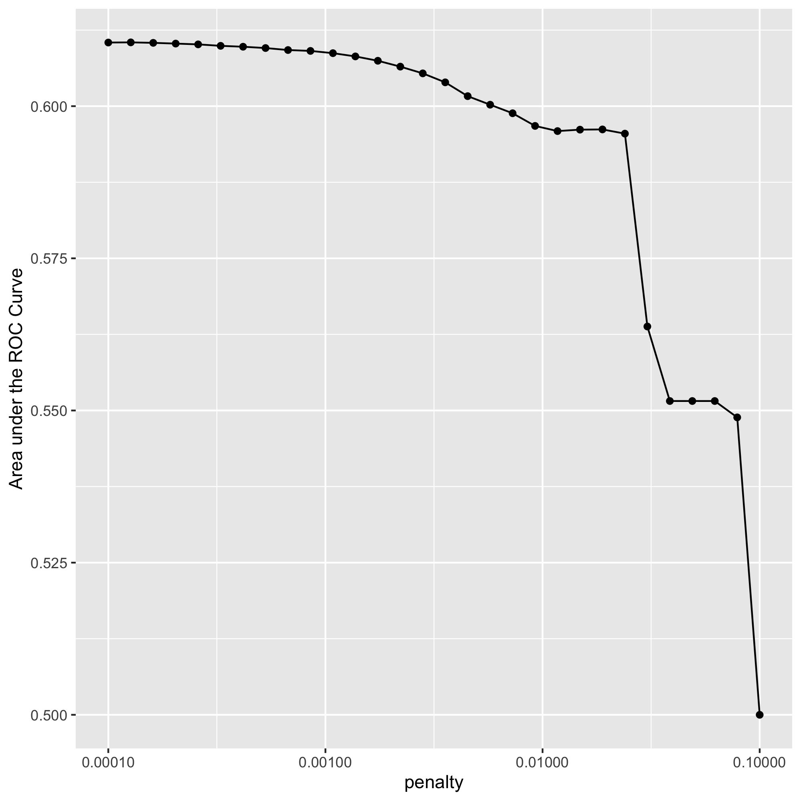

My selected penalty value is 0.000853. Looking at the “top_models” output, model 10 has the largest mean AUC, 0.609, with a penalty of 0.000853. Additionally, based on the penalty vs AUC plot above, AUC appears to begin to decrease after about model 10. 

**Finally, provide your ROC plots and interpret them. How effective is your penalized logistic regression model at predicting each of the five wealth outcomes?**

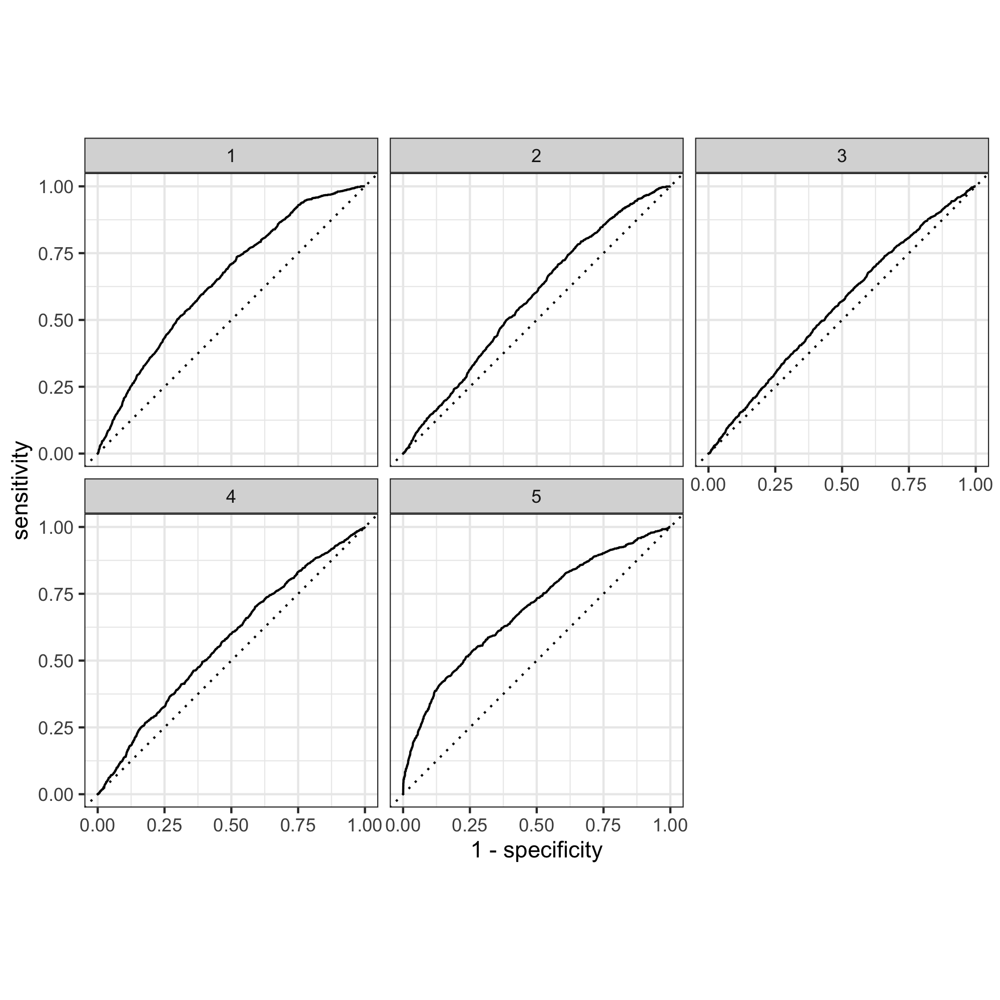

I used a penalty of 0.000853, or slice 10, for the ROC plots. To determine how effective the model is, we can look at how close the plot is to the 45 degree line; the closer to the straight line the worse the model is at predicting the wealth outcome versus the others. The penalized logistic regression is most effective at predicting wealth outcomes 1 and 5, and less effective at differentiating 2, 3, and 4 from the others. The model performed best when predicting wealth group 5, then 1. It seems to perform okay, but not well when predicting groups 2 and 4, but overall appears to not perform very well when differentiating between 2, 3, and 4, or the middle wealth outcomes. 

### Model 2

**Using the R script provided, set up your random forest model and produce the AUC - ROC values for the randomly selected predictors, and the minimal node size, again with wealth as the target.**

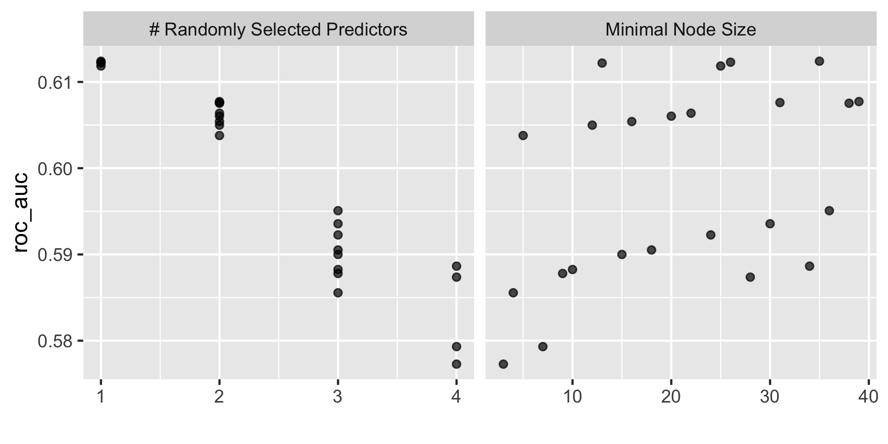

**How did your random forest model fare when compared to the penalized logistic regression?**

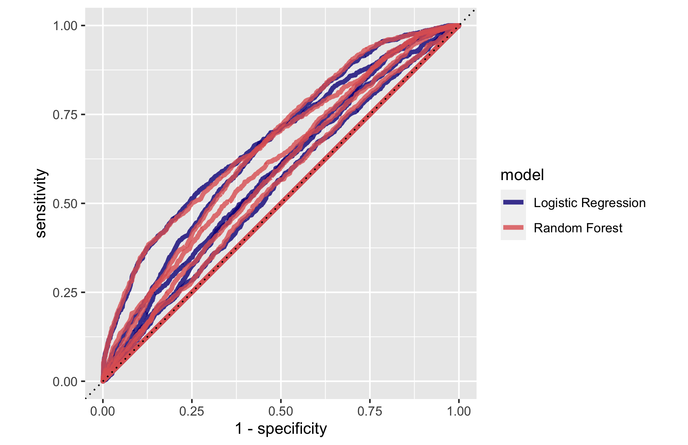

The random forest model is fairly comparable to the penalized logistic regression. It appears to perform a little better than the penalized logistic regression in some wealth outcomes, but overall the models performed similarly.  

**Provide your ROC plots and interpret them.**

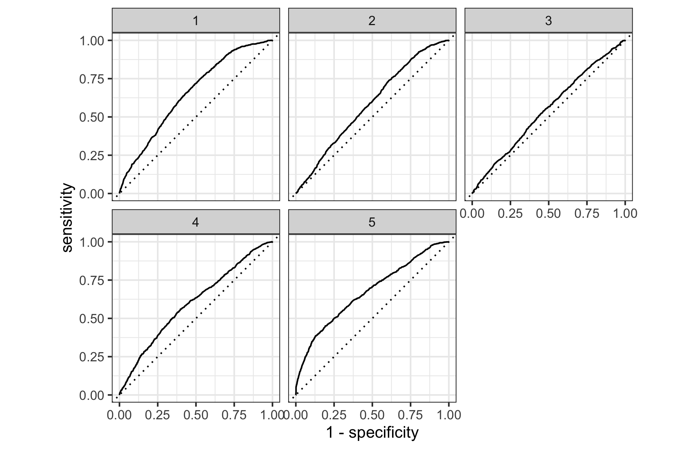

Similar to the penalized logistic regression, the random forest model is most effective at predicting wealth outcomes 1 and 5, and less effective at differentiating 2, 3, and 4 from the others. The model overall appears to not perform as well when differentiating between 2, 3, and 4, or the middle wealth outcomes. There does appear to perhaps be a small improvement in predicting the middle wealth outcomes versus the penalized logistic regression, but overall the models perform similarly. 

**Are you able to provide a plot that supports the relative importance of each feature's contribution towards the predictive power of your random forest ensemble model?**

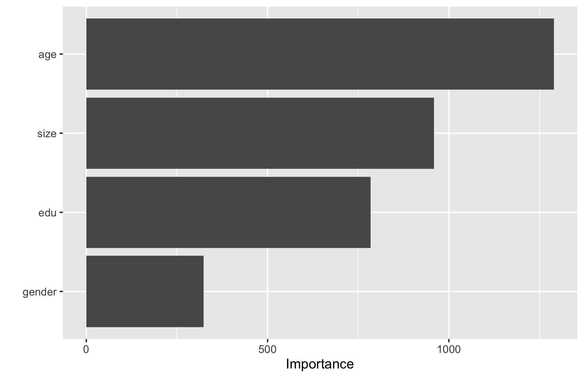

It appears that age is the most important feature in terms of contribution to predictive power, and gender is the least important. 

### Model 3

**Using the python script provided, train a logistic regression model using the tensorflow estimator API and your DHS data, again with wealth as the target. Apply the linear classifier to the feature columns and determine the accuracy, AUC and other evaluative metrics towards each of the different wealth outcomes.**

| Evaluative Metric      | Result (wealth 1)    | Result (wealth 2)    | Result (wealth 3)    | Result (wealth 4)    | Result (wealth 5)    |
| ----------- | ----------- | ----------- | ----------- | ----------- | ----------- | 
| accuracy               |  0   | 0.777342   | 0.780971  | 0.832271   |  0.823345   |
| accuracy_baseline      |  0  | 0.777342   | 0.780971   | 0.832271   | 0.823737  |
| auc                    |  0 | 0.686192  | 0.646600   | 0.649065  | 0.719188    |
| auc_precision_recall   |  0  | 0.313106   | 0.278746   | 0.235587   | 0.332359   |
| average_loss           |  0  | 0.476321   | 0.478807  | 0.421690   | 0.411229  |
| label/mean             |  0  | 0.222658   | 0.219029   | 0.167729  | 0.176263   | 
| loss                   |  0 | 0.476321   | 0.478807   | 0.421690 | 0.411229  | 
| precision              |   0  | 0.000000  | 0.000000   | 0.000000   | 0.388889   | 
| prediction/mean        |  0  | 0.232126   | 0.223921   | 0.175702  | 0.185450 |
| recall                 |  0  | 0.000000   | 0.000000   | 0.000000  | 0.003895 |
| global_step            |  0  | 100.000000   | 100.000000   | 100.000000   | 100.000000  |

**Then continue with your linear classifier adding the derived feature columns you have selected in order to extend capturing combinations of correlations (instead of learning on single model weights for each outcome). Again produce your ROC curves and interpret the results.**

Wealth 1:

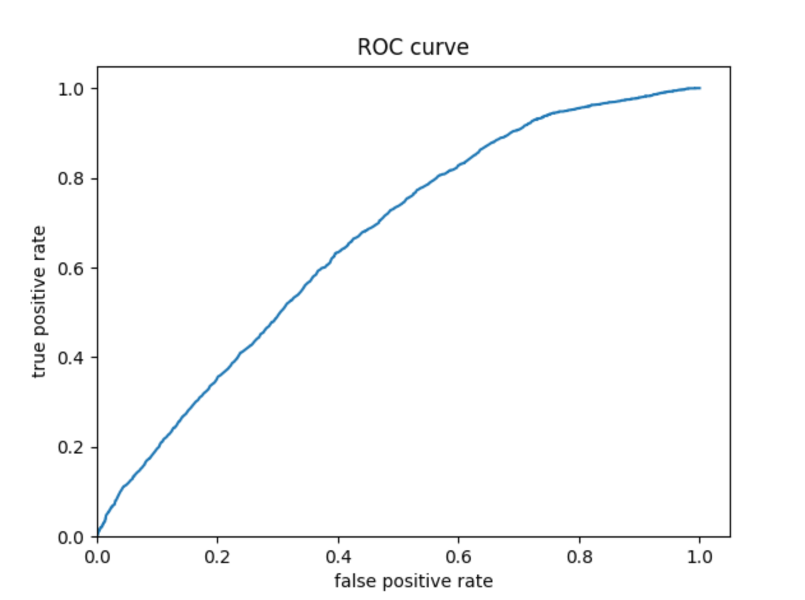


Wealth 2:

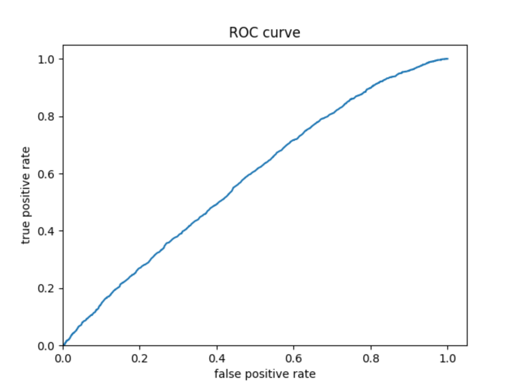

Wealth 3:

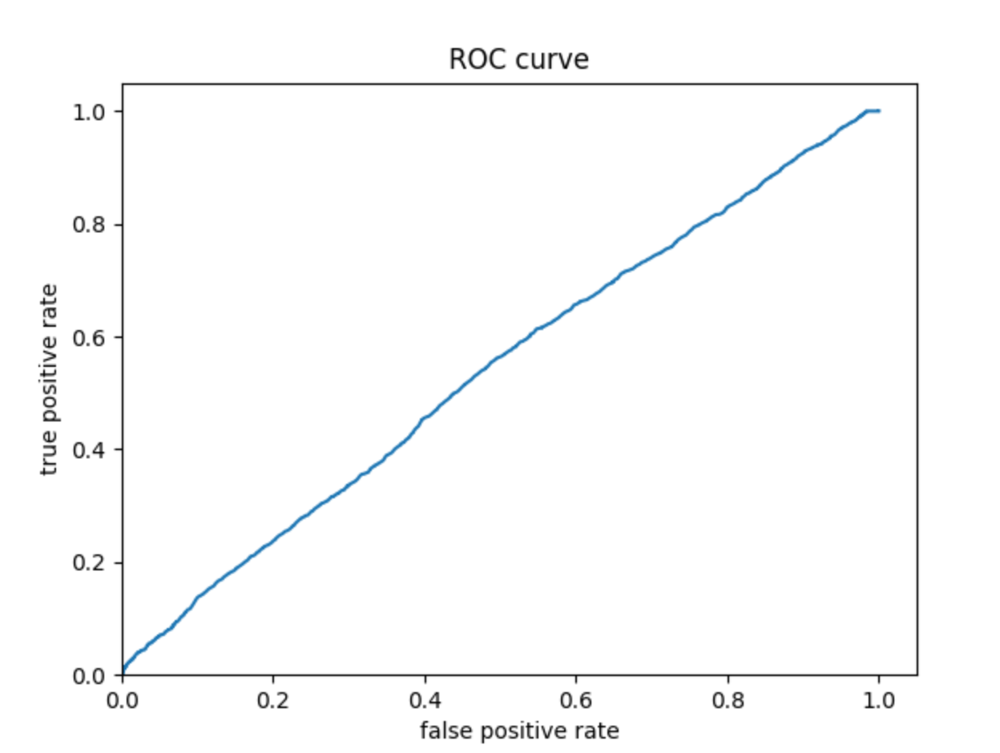

Wealth 4:

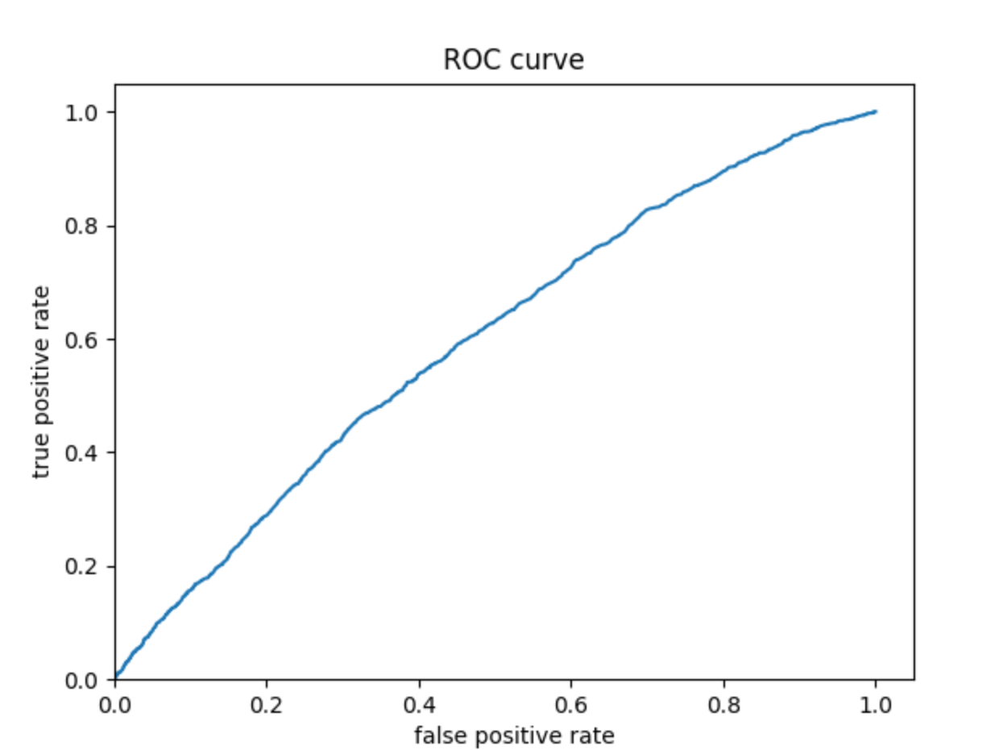

Wealth 5:

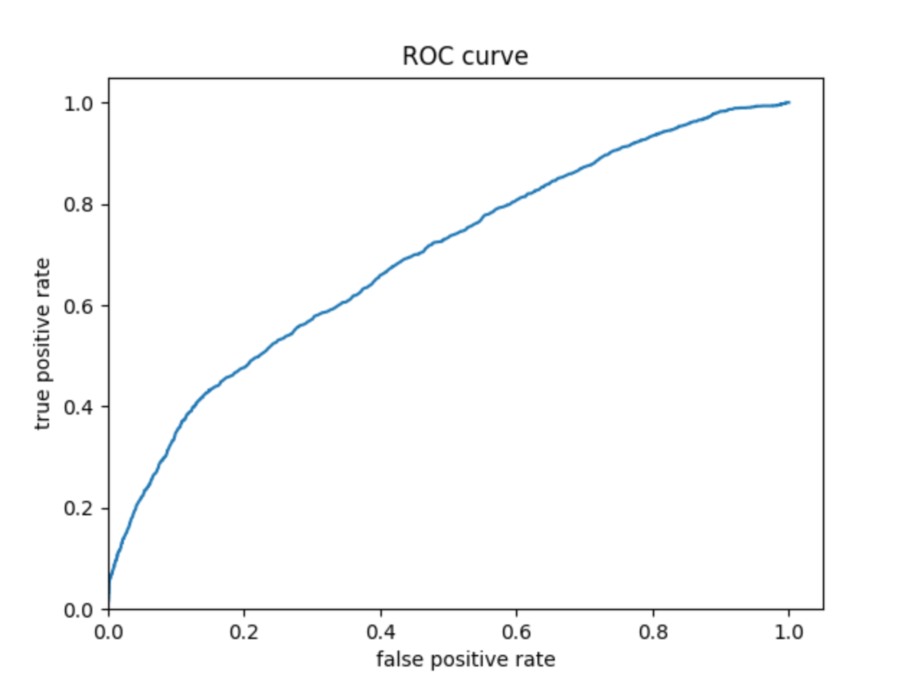

### Model 4

**Using the python script provided, train a gradient boosting model using decision trees with the tensorflow estimator. Provide evaluative metrics including a measure of accuracy and AUC.** 

| Evaluative Metric      | Result (wealth 1)    | Result (wealth 2)    | Result (wealth 3)    | Result (wealth 4)    | Result (wealth 5)    |
| ----------- | ----------- | ----------- | ----------- | ----------- | ----------- | 
| accuracy               |  0   | 0.777538   | 0.780383  | 0.833448   | 0.832369   |
| accuracy_baseline      |  0  | 0.777342   | 0.780971   | 0.832271   | 0.823737  |
| auc                    |  0 | 0.731486  | 0.685921   | 0.681143  | 0.751930    |
| auc_precision_recall   |  0  | 0.380212   | 0.321306   | 0.266240   | 0.405463   |
| average_loss           |  0  | 0.448817   | 0.457983  | 0.401714   | 0.387140  |
| label/mean             |  0  | 0.222658   | 0.219029   | 0.167729  | 0.176263   | 
| loss                   |  0 | 0.448817   | 0.457983   | 0.401714 | 0.387140  | 
| precision              |   0  | 0.527778  | 0.400000   | 0.875000   | 0.814286   | 
| prediction/mean        |  0  | 0.222825   | 0.213938   | 0.167415  | 0.178771 |
| recall                 |  0  | 0.008370   | 0.005374   | 0.008187  | 0.063439 |
| global_step            |  0  | 100.000000   | 100.000000   | 100.000000   | 100.000000  |

**Produce the predicted probabilities plot as well as the ROC curve for each wealth outcome and interpret these results.**

### Analyze all four models

**According to the evaluation metrics, which model produced the best results?**

**Were there any discrepancies among the five wealth outcomes from your DHS survey dataset?**
