# Project 3: Zambia Population Distribution

## Intro

Population and geospatial data for Zambia were downloaded. Geospatial data included variables such as night time light, topography, bodies of water, cropland, tree cover, urban areas, and more. 

Two models, a linear regression model and a random forest model, were run to predict population distribution in Zambia. The predicted values were compared to known population data through mapping, mean square error calculation, and plotting of statistics (mean square error, absolute square error, and root mean square error). 

*Goals of this project:* Use two machine learning methods predict population values at 100 x 100 meter resolution throughout your selected country. Validate the two models using different methods presented in this class. Write a report assessing the two approaches and which of the two models was more accurate. Be sure to account for spatial variation throughout your selected location and provide substantive explanations for why those variations occurred.

## Zambia

**Map of Zambia:**

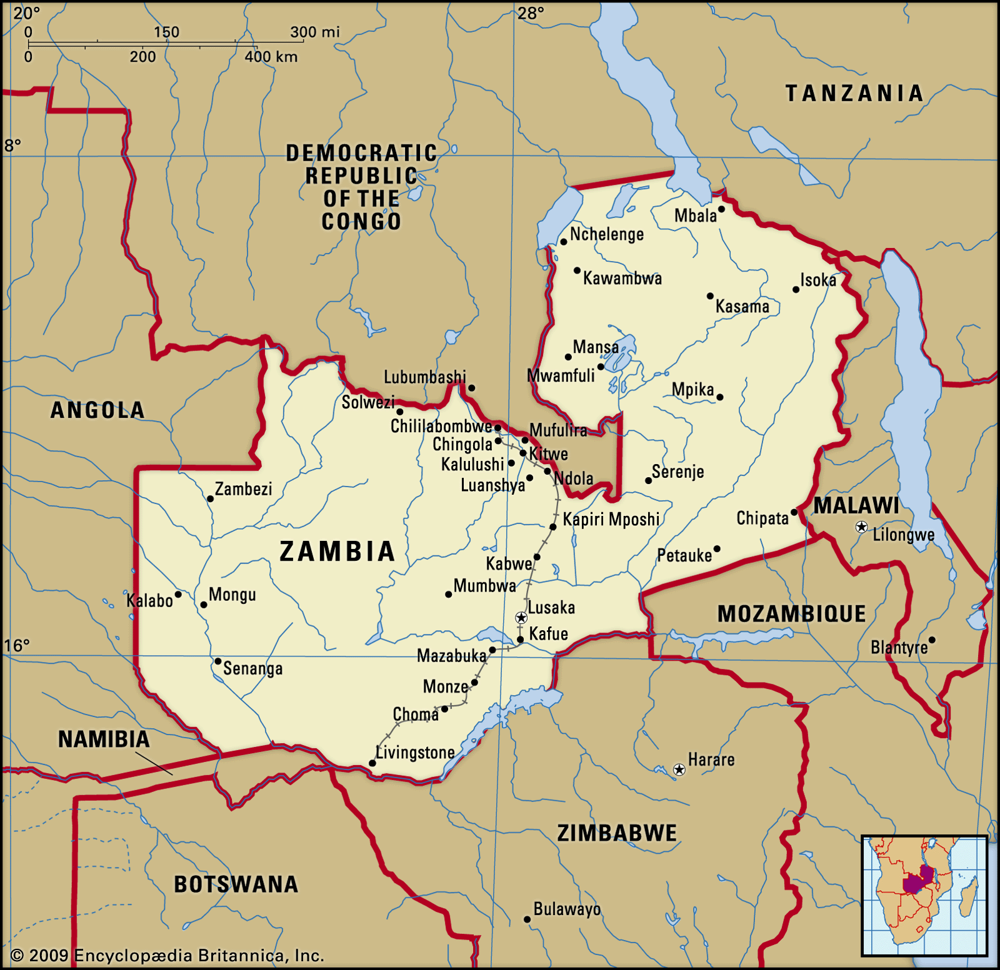

**Capital:** Lusaka

**Provinces:** 10 (Central, Copperbelt, Eastern, Luapula, Lusaka, Muchinga, Northern, North-Western, Southern, Western) 

**Districts:** 117 as of 2018 (*NOTE:* 72 districts in 2011 and 72 in this dataset; more districts created since 2011) 

**Total population (2019):** 17,964,587

## Linear Regression Model

First, a linear regression model was run to predict population distribution of Zambia. The data were split into a training and a test set, and a linear regression model was then run. Different population measures were calculated and plotted - seen below. 

We can check that we have the correct number of summed gridcell proportions (predicted values / predicted totals) using ``` cellStats(gridcell_proportions_sums, sum) ```, which should equal the number of districts, or 72. And we get 72.00913.

**Below is a plot of the predicted population distribution:**

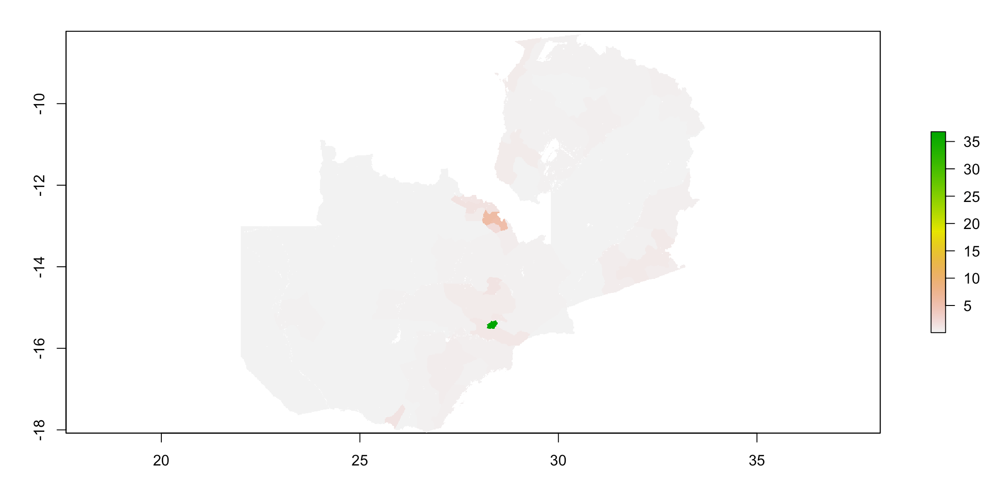

**Below is a plot of the actual population distribution:**

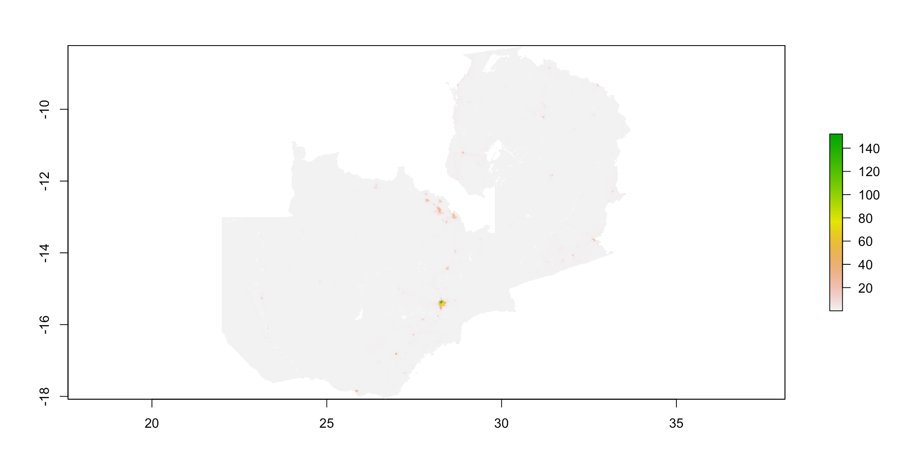

### Validation of the linear regression model 

One way we can measure how the model performed is to look at the difference in predicted versus actual population values. **Below is a plot of the difference (predicted - actual):**

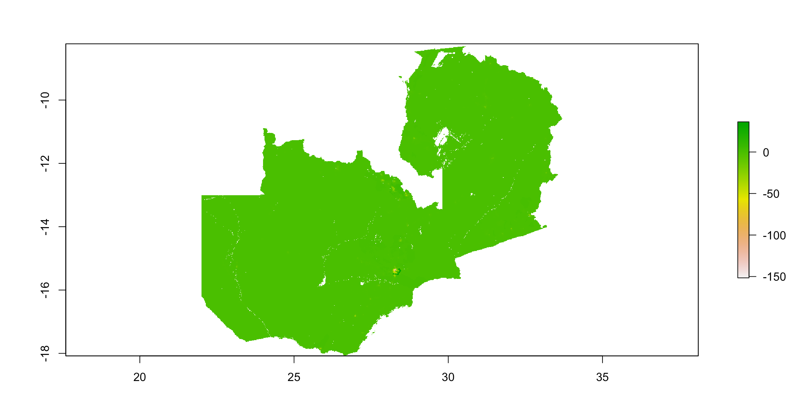

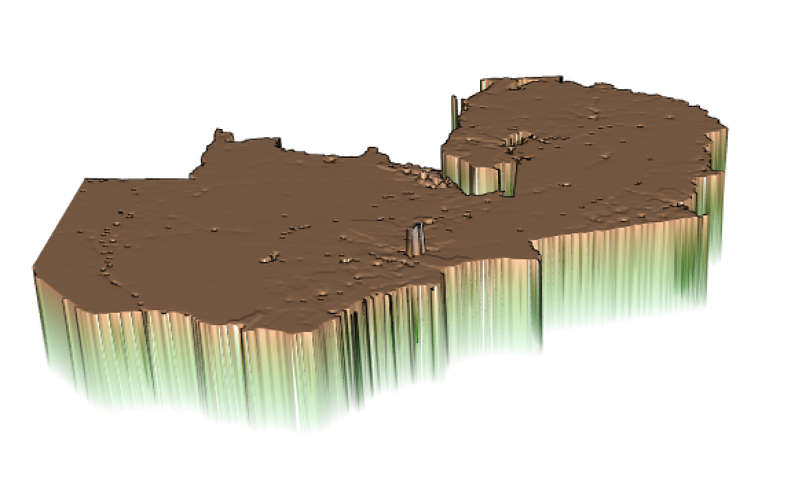

It appears that the linear regression model over-predicted at most locations, and under-predicted around the capital city, Lusaka, as well as other more populated/densely populated areas like the central Northern area of Zambia.

We can calculate the absolute value of the **sum of all differences** using ```cellStats(abs(diff_sums), sum)```, and we get 15,170,112.

Then, we can also **compare the predicted population total to the actual population total**. The predicted total, calculated using ```cellStats(population_sums, sum)```, equaled 17,966,217. And the actual population total, calculated using ```sum(zmb_adm2$pop19)```, equals 17,964,587.

Then, we can take a closer look at an area of interest. I decided to look closer at the Lusaka area. Lusaka is the capital of Zambia, and as can be seen in the plots above, it appears to be the most populated area. Additionally, it appears that the population there was under-predicted (versus the majority of the country where the population was over-predicted). To zoom in on this area, I filtered the data by the Lusaka province and the neighboring Chibombo district of the Central province.  

**Plot:**


Finally, I calculated the **Mean Square Error**, and plotted the **Mean Square Error, Mean Absolute Error,** and **Root Mean Squared Error** for the predicted vs actual population values. As seen below, error tends to be higher in the more highly populated areas of Zambia. 

Mean Square Error: 404,314.9

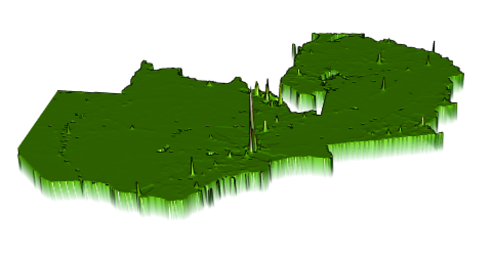

Mean Absolute Error:

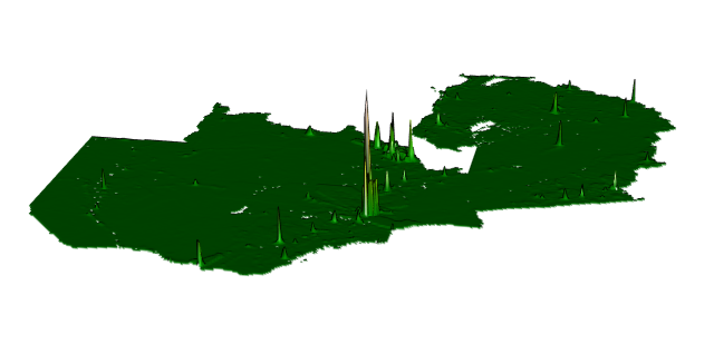

Root Mean Squared Error: 

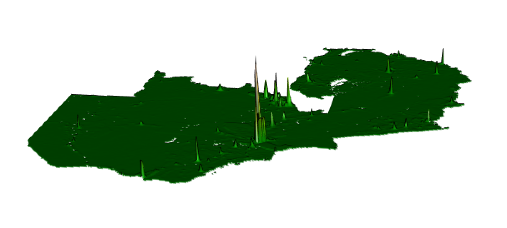


Mean Square Error was calculated utilizing the ```MLmetrics``` library.

```
# add to dataframe so that we can calculate mse
lr_pop_sums <- exact_extract(population_sums, zmb_adm2, fun=c('sum'))
zmb_adm2 <- zmb_adm2 %>%
  add_column(lr_pop_sum = lr_pop_sums)

# MSE function in MLmetrics package
# https://www.rdocumentation.org/packages/MLmetrics/versions/1.1.1/topics/MSE
MSE(y_pred = zmb_adm2$lr_pop_sum, y_true = zmb_adm2$pop19)
```


## Random Forest Model

A random forest model was also used to predict population in Zambia. 

First, we can look at the error of the random forest model:

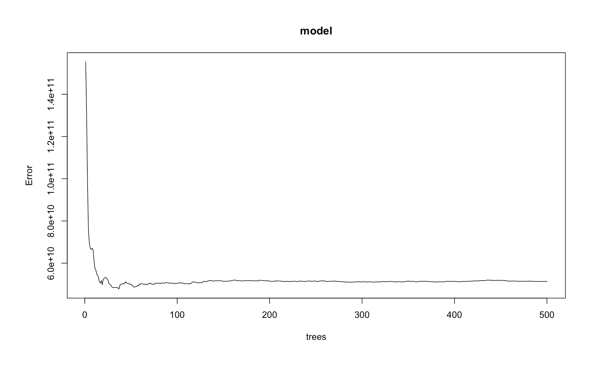

Error drops after a small number of trees, then remains relatively the same as the number of trees used in the model increases.

We can also look at the variable importance in this model:

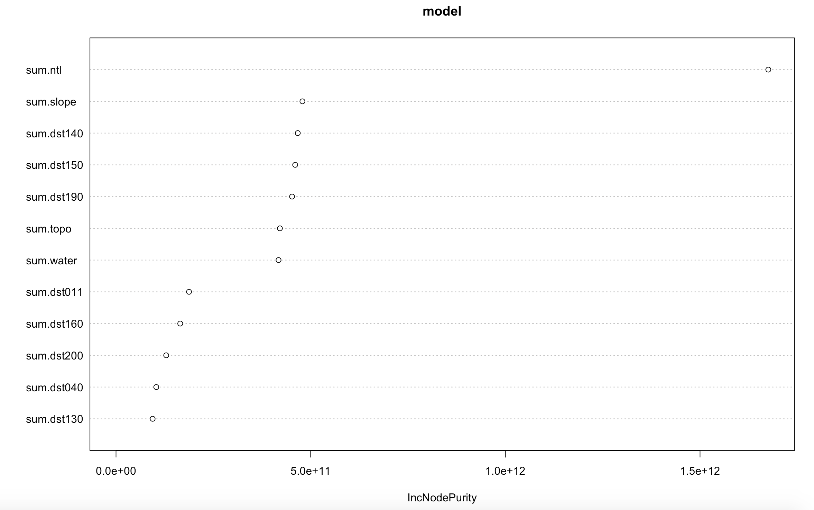

From the above plot, it looks like the variable "ntl," or night time light, is the most important variable in predicting population. This is a similar result to what was found in the initial look at the data ([March 24/26 Response](https://natallzl.github.io/data310/March24Response.html)).

After running the model, we can check that we have the correct number of summed gridcell proportions (predicted values / predicted totals) using ``` cellStats(gridcell_proportions_sums, sum) ```, which should equal the number of districts, or 72. And we get 72.00756.

**Below is a plot of the predicted population distribution:**

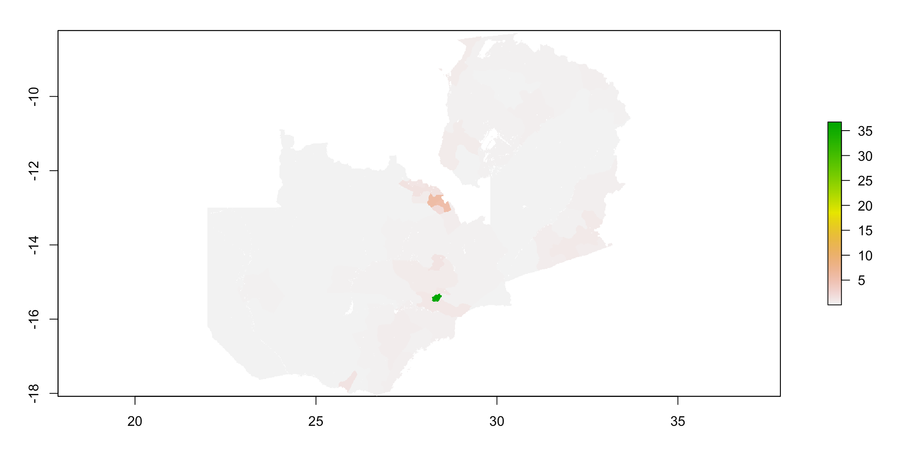

**Below is a plot of the actual population distribution:**

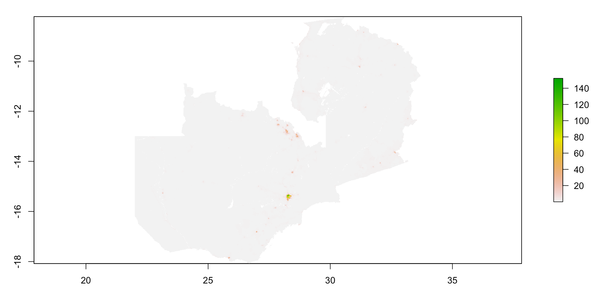

### Validation of the random forest model

**Below is a plot of the difference (predicted - actual):**

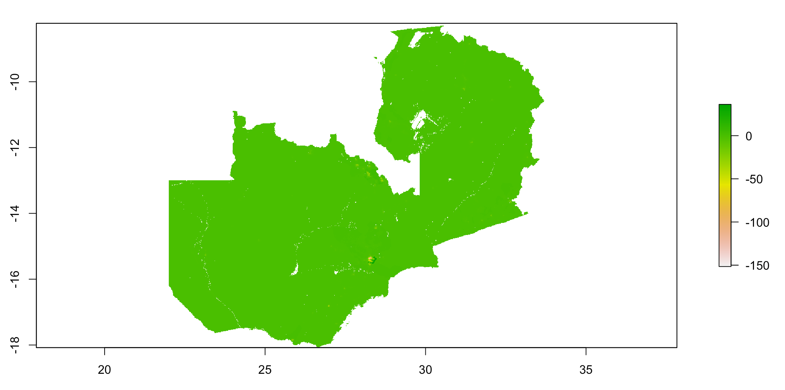

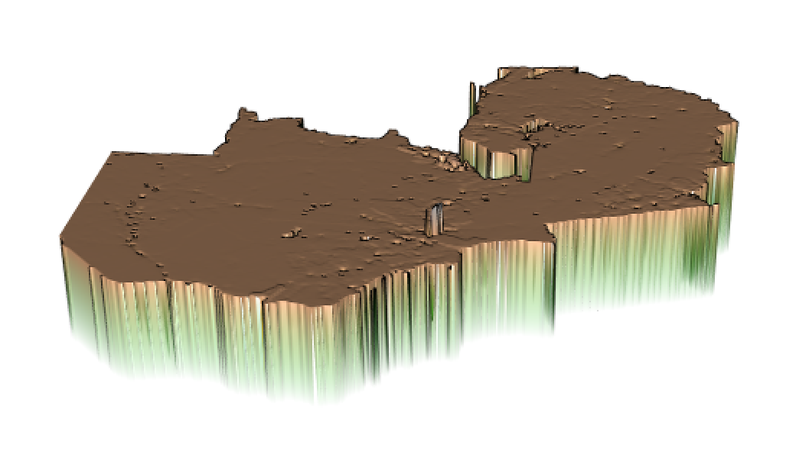

It appears that the random forest model performed comparably to the linear regression model. It over-predicted at most locations, and under-predicted around the capital city, Lusaka, as well as other more populated/densely populated areas like the central Northern area of Zambia.

We can again calculate the absolute value **sum of all differences**, and we get 15,266,109.

The **predicted population total** equaled 17,965,958, versus the **actual population total**, which equals 17,964,587. So, the random forest model over-predicted the population of Zambia.

**Below is a plot of the Lusaka province and neighboring Chibombo district:**

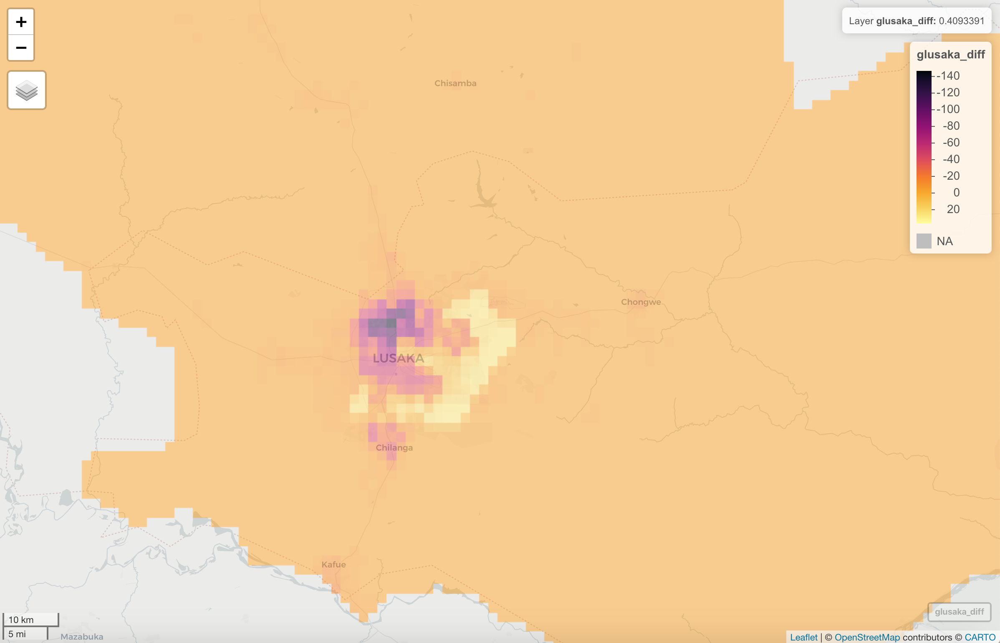

Similar to the linear regression model, the random forest model tended to over-predict population, except in areas of higher population like the city of Lusaka, where the model under-predicted population distribution. 

Finally, I calculated the **Mean Square Error**, and plotted the **Mean Square Error, Mean Absolute Error,** and **Root Mean Squared Error** for the predicted vs actual population values. As seen below, error again tends to be higher in the more highly populated areas of Zambia. 

Mean Square Error: 405,818.6

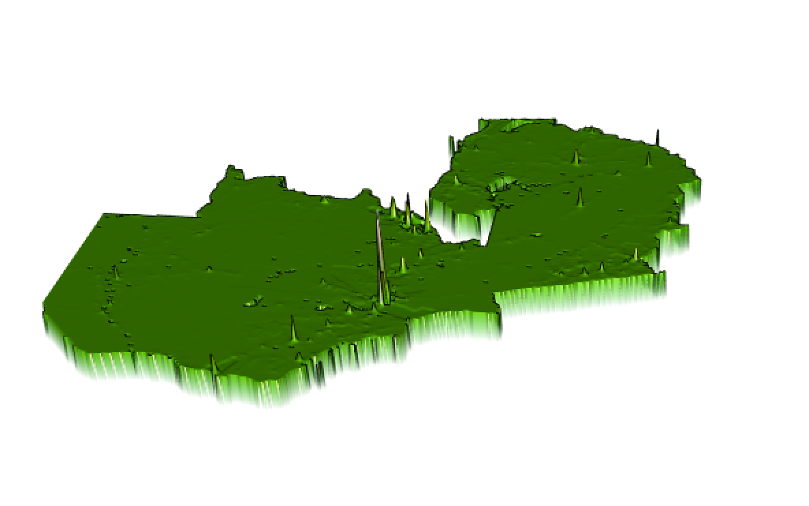

Mean Absolute Error:

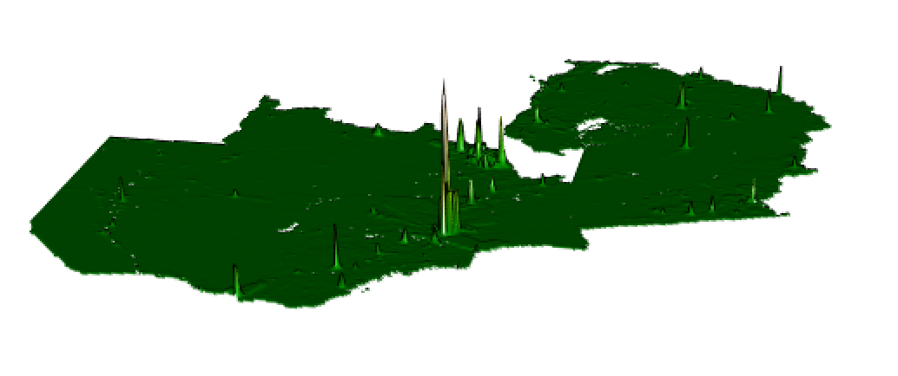

Root Mean Squared Error: 

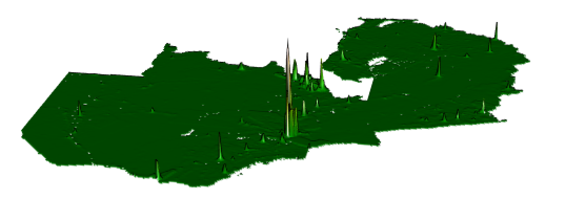


## Analysis and Conclusions

### Which model was more accurate?

Comparison of zoomed in differences (Lusaka area; Linear Regression model, Random Forest model):

 

Even zoomed in, the maps of the difference (predicted - actual) are very, very similar - so let's compare some stats:

| Measure      | Linear Regression Result    |  Random Forest Result    | Actual (if applicable)    |
| ----------- | ----------- | ----------- | ----------- |
| sum of all differences          | 15,170,112     | 15,266,109     |   |
| population total     |  17,966,217  | 17,965,958   | 17,964,587   |
| mean square error                   |  404,314.9 | 405,818.6  |   | 

Based on the model outputs and model validation and analysis, the linear regression model was more accurate. The lower the MSE, the higher the accuracy of the prediction made by the model. The linear regression model had a slightly smaller MSE (404,314.9) than the random forest model (405,818.6), which suggests the linear regression model was more accurate. 

Additionally, the sum of all differences (sum of all differences of the absolute value of predicted population - actual population for each cell) is slightly smaller for the linear regression model (15,170,112) than the random forest model (15,266,109). This again suggests that the linear regression model was more accurate because overall, the predicted values are closer to the actual values for that model. 

Looking at predicted population total, the result of the random forest model (17,965,958) is closer to the actual population total (17,966,217) than the result of the linear regression result (17,965,962); however, the difference is quite small. These results make sense, as both models tended to overpredict population counts. 

Finally, we can compare the plots of mean error, mean absolute error, and root mean square error (Linear Regression model, Random Forest model):

 

 

 

The plots look practically the same, which again indicates that the model accuracy is similar between the linear regression and the random forest models. So, after considering all of the results, the linear regression model was more accurate, though model performance was very, very similar.

### Account for spatial variation throughout Zambia; why did these variations occur?

First, we can take another look at the plots of predicted values from both models. 

 

Comparing these plots to the map of Zambia shown at the beginning of this project (and shown below), the area with the highest predicted populations appears to coincide with the location of Lusaka, the capital city of Zambia. Additionally, other areas with higher population (in light red) appear to coincide with other established locations, such as Livingstone in southern Zambia, Petauke and Chipata in the east, and a number of other towns/cities in central northern Zambia (the Copperbelt Province; where there is a lot of copper mining). It should be noted that these are also the areas in which the highest measures of error are seen (see above; plots of mean error, mean absolute error and root mean square error). 


Generally, both models tended to over-predict population. One of the most interesting spatial variations to note is where population is over-predicted versus where it is under-predicted. Population is over-predicted almost everywhere, except in what appears to be the most populated areas, like Lusaka. 

 

I think the reason for this difference in under/over-prediction can be attributed to population density which may not be captured by factors used in our model prediction like night time light and other factors. Typically, in cities, more people live closer together in less space. The dark purple areas on the above plots are where the population was most under-predicted, so I might make an educated guess that the population is the most dense in those areas. 

It should also be noted that as you look outside of the most densly populous center (purple), the plot has some areas of yellow, which are areas that population is actually MORE over-predicted than the surrounding orange areas. One explanation I can think of for this, which was touched on in class on Wednesday (April 14), is that there are still a lot of buildings (and thus a lot of night time light) in these areas, but instead these areas might have office buildings or factories. Perhaps these areas are where there are a lot buildings (similar to densely populated area) but instead of living there, people could instead work in, eat in, and visit those areas. A future step could be taken to add a layer for building footprint, to see how that affects performance of the models.

**Map Source:** [Britannica](https://www.britannica.com/place/Zambia)

**Code:** [Project3.R](https://github.com/natallzl/data310/blob/main/Project3.R)
