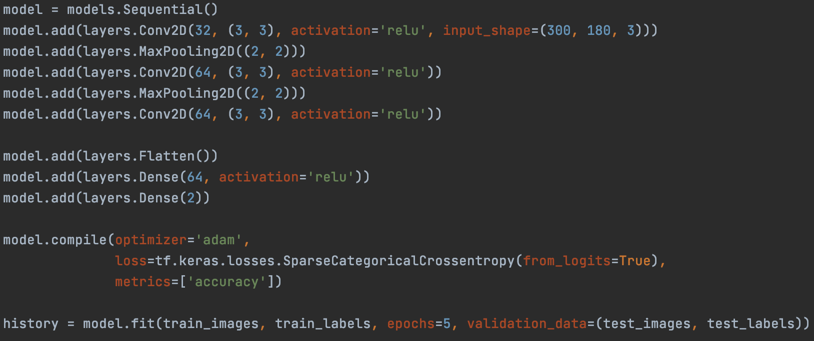
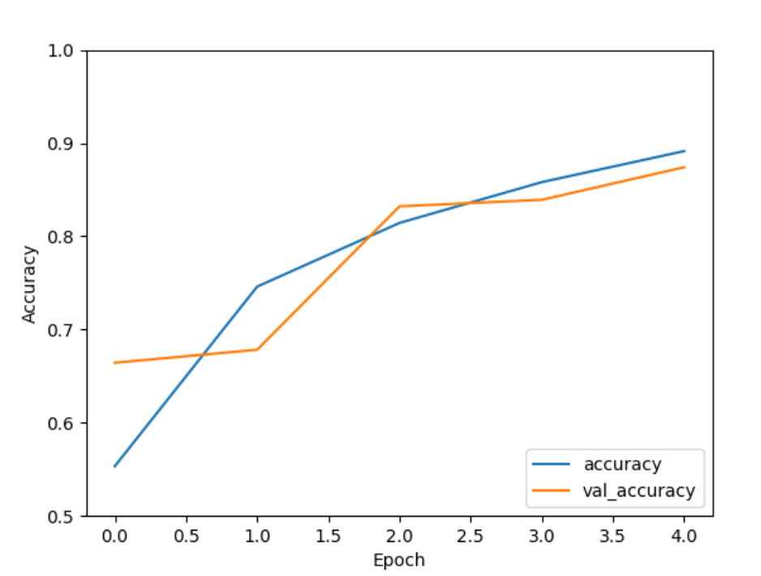

## Problem Statement

Most crops that we grow for consumption require pollination, and pollination is essential for natural plant communities as well. Bees are essential pollinators, about 80% of pollination around the world is taken care of by honey bees. It has been said that for one out of every three bites of food, bees are responsible for that bite. With changes in land use, increased pesticide use, and climate change, as well as a number of other factors, bee communities have been declining. 

The number of worker bees in a colony is essential to its functioning. Worker bees collect pollen on their legs; the hairs on their bodies attract grains of pollen, which are then formed into pockets or "baskets" on their legs for carrying back to the hive. To understand behavior of bees (hierarchy interactions, prospective activity, and more) as well as colony health, hive and honey bee activity can be observed. Typically, this observation is done manually by researchers. Machine learning has the potential to observe and classify activity automatically and more quickly than humans, which can allow for large scale data collection and can possibly lead to new insights into bee activity and colony health. 

In *Recognition of Pollen-Bearing Bees from Video Using Convolutional Neural Network*, Rodriguez et al. aimed to recognize pollen-bearing bees from videos of a hive entrance, with a goal to automatically oversee honey bee activity such as foraging behavior and task specialization. After testing multiple approaches, their convolutional neural network approach outperformed the others.

**Research question:** Can we create a convolutional neural network model that can accurately classify whether a bee is carrying pollen or not?

----------
*Research sources:*
- [MSU Department of Entomology](https://www.canr.msu.edu/nativeplants/pollination/)
- [UofA Division of Agriculture](https://www.uaex.edu/farm-ranch/special-programs/beekeeping/pollinators.aspx)
- [EPA](https://www.epa.gov/pollinator-protection/pollinator-health-concerns)
- [Greenpeace](https://www.greenpeace.org/usa/sustainable-agriculture/save-the-bees/)
- [*Recognition of Pollen-Bearing Bees from Video Using Convolutional Neural Network*](https://doi.org/10.1109/WACV.2018.00041)

----------

## Data Description

I am using a honey bee image dataset from Kaggle that is based on data used in the publication [*Recognition of pollen-bearing bees from Video using Convolutional Neural Network*](https://doi.org/10.1109/WACV.2018.00041) by Ivan Rodriguez, Rémi Mégret, Edgar Acuña, José Agosto, and Tugrul Giray. The images are stills from videos recorded at the Bee facility of the Gurabo Agricultural Experimental Station of the University of Puerto Rico in 2017.

- 714 image files of bees carrying/not carrying pollen
  - images with filenames beginning with "P" are images of bees carrying pollen
  - images with filenames beginning with "NP" are images of bees *not* carrying pollen
- A corresponding .csv file 
  - 714 rows and 3 columns
- Variables:
  - index number
  - filename
  - pollen carrying classification: 0 or 1, discrete variable

**Example images from dataset:**

| Pollen carrying (1) |  Non-pollen carrying (0) |
| ----------- | ----------- |
|   |     |

Note the pollen baskets on the bee carrying pollen. 

*Data source:* ["Honey Bee pollen," Kaggle](https://www.kaggle.com/ivanfel/honey-bee-pollen)

## Machine Learning Method

I plan to use a CNN model, a convolution neural network. We used a CNN for image classification in class, so I think utlizing this kind of model is a good place to start. The paper that the dataset is based on, linked above, also takes a convolutional neural network approach, so it will be interesting to compare my model accuracy/success to that in the paper. In order to use this model, I will have to split the images into training and test images. I will also need to figure out how to classify the images, or how to add the labels pollen/no pollen to the images. 

Model architecture:

I utilized convolutional neural network code we used in class, and modified it to fit my honey bee classification purposes. Because the images are in color, the model has three Conv2D and Pooling layers, with an initial input shape of (300, 180, 3). It also has a flatten layer and two dense layers. Because the classification is categorical, pollen carrying or not, I chose to use SparseCategoricalCrossentropy in compiling the model. Finally, after testing different numbers of epochs, I chose to run the model for a total of five epochs. Below is a visualization of model performance. 

Training accuracy = 0.8782, Test accuracy = 0.8741
